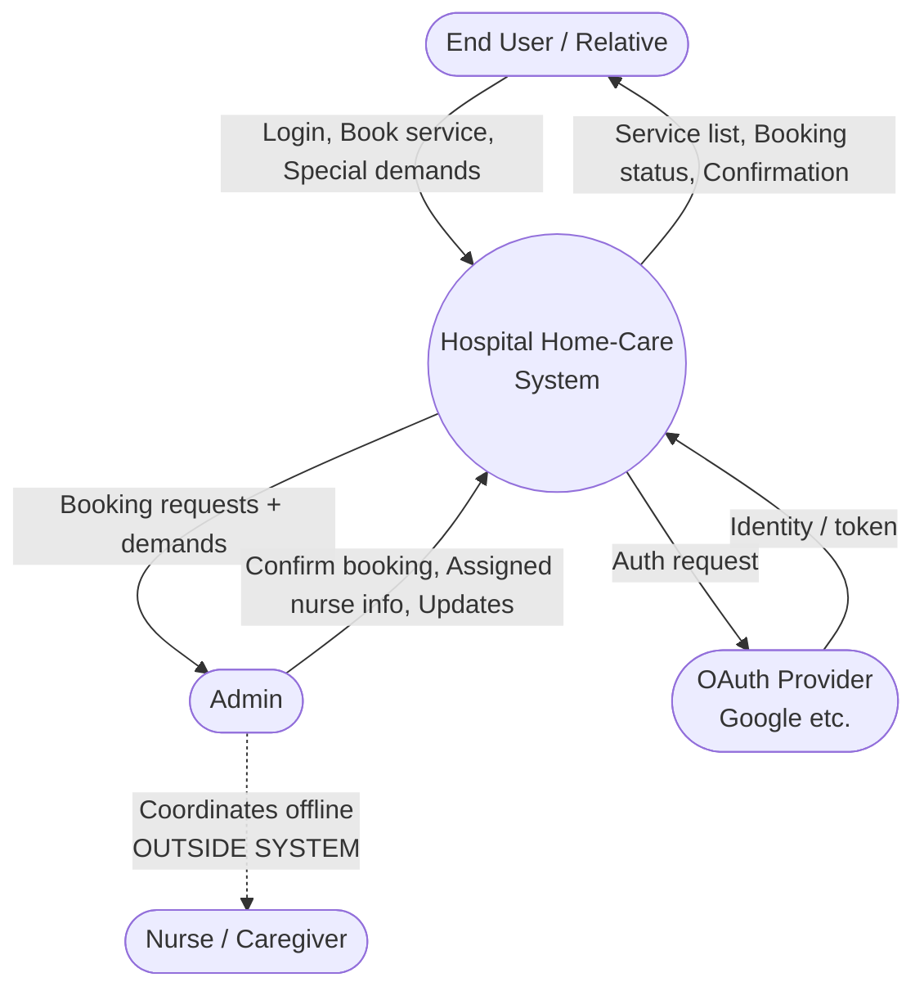
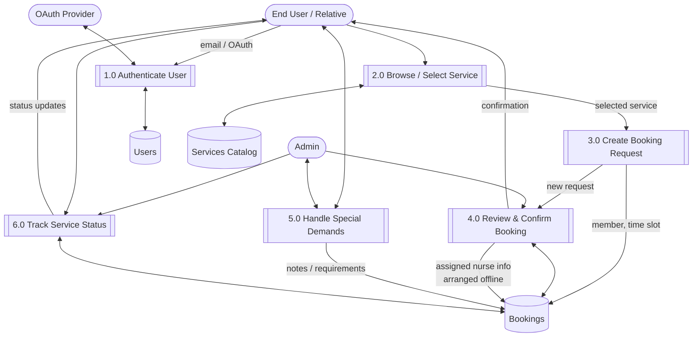
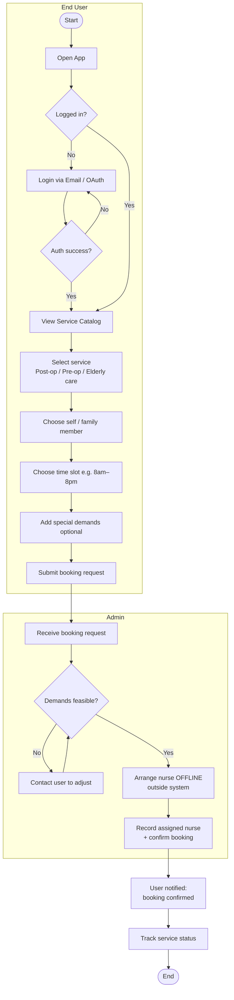
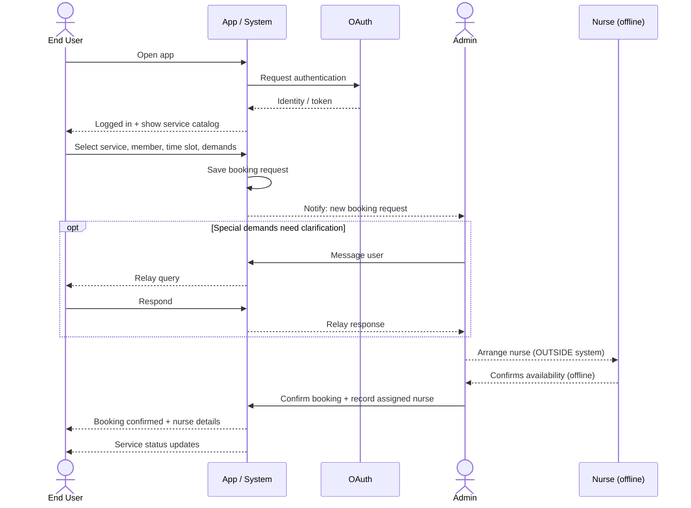
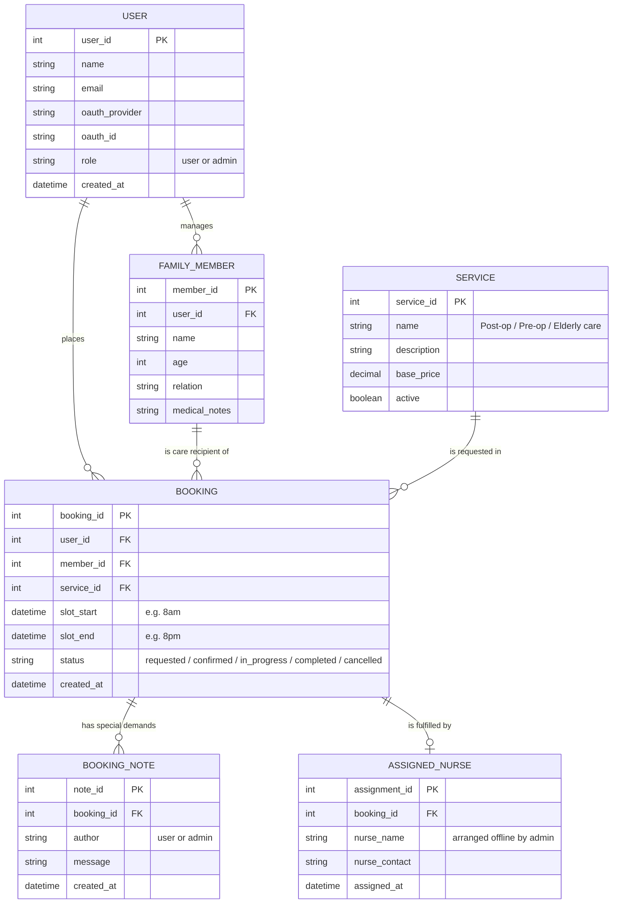

# Hospital Home-Care System — Diagrams

**Actors (2):**
- **End User / Relative** — logs in, browses services, books care for self or a family member, adds special demands.
- **Admin** — reviews booking requests, arranges a nurse **offline (outside the system)**, confirms the booking, records the assigned nurse.

> The **nurse is not a system user**. All admin ↔ nurse coordination happens outside this app; the system only stores the outcome.

---

## 1. Context Diagram (DFD Level 0)

---

## 2. DFD Level 1 (processes + data stores)

---

## 3. Activity Diagram (booking flow, swimlanes)

---

## 4. Overall Workflow (Sequence diagram)

---

## 5. ER Diagram (database schema)

> **Note on `ASSIGNED_NURSE`:** the nurse is not a system account. This table only records the details the admin enters after arranging the nurse offline, so the user can see who will arrive.
